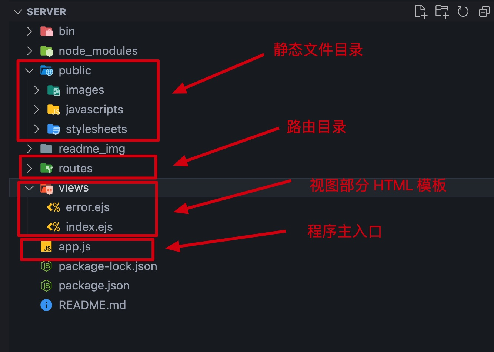

# 项目初始化
#### 初始化项目

- 终端运行 `npm install express-generator -g` 命令将 [Express](https://www.expressjs.com.cn/) 应用程序生成器安装到全局；
- 使用 `express --view=ejs server` 命令创建 [Express](https://www.expressjs.com.cn/) 模板项目，其中 `--view=ejs`表示模板引擎使用 [ejs](https://ejs.bootcss.com/);


#### 项目目录结构



#### 安装 nodemon 自动检测代码改变重新启动服务器

- 终端运行`npm install nodemon -S`
- 修改`package.json`文件如下：

```json
"scripts": {
  "start": "nodemon ./bin/www"
}
```

- 使用`npm start`将项目跑起来，以后每次保存代码将自动运行新的修改

#### 4. 安装运行依赖 `cross-env`并配置环境变量

- 终端运行`npm install cross-env -D `导入开发依赖库；

- 修改环境编译脚本：

```json
  "scripts": {
      "dev": "cross-env NODE_ENV=development nodemon ./bin/www",
      "prod": "cross-env NODE_ENV=production nodemon ./bin/www"
  }
```

#### 安装数据库相关组件

- 终端运行`npm install sequelize -S`数据库 ORM 组件本地安装；
- 终端运行`npm install mysql2 -S`数据库组件本地安装；
- 终端运行`npm install sequelize-cli -g`安装 sequelize 脚手架
- 终端运行`sequelize init`初始化数据库管理目录结构，完成反馈如下：`xxx`表示文件路径

```shell
# 数据库配置文件
$ Created "config/config.json"
# 数据库模型文件
$ Successfully created models folder at "xxx/models".
# 数据库迁移文件
$ Successfully created migrations folder at "xxx/migrations".
# 数据库种子文件
$ Successfully created seeders folder at "/xxx/seeders".
```

#### 添加 Sequelize-cli 环境配置文件

- 在根目录下创建一个名为`.sequelizerc`的文件，这是`Sequelize-lic`运行时读取的配置文件
- 配置选项如下：

```javascript
const path = require("path");
module.exports = {
  // env:设置 Sequelize 的环境变量,默认读取系统的环境变量 NODE_ENV 的值,
  // 如果不存在 NODE_ENV 则为 development
  // 注意：该变量会影响下面config 的读取
  env: "development",
  config: path.resolve("database", "config/config.json"), // Sequelize 数据库配置文件存放目录。
  "seeders-path": path.resolve("database", "seeders"), // 数据库种子脚本文件存放目录
  "migrations-path": path.resolve("database", "migrations"), // 数据库迁移脚本文件存放目录
  "models-path": path.resolve("database", "models"), // 数据库模型文件存放目录
  debug: true, // 是否显示详细的debug信息
};
```

#### 配置数据库

- 数据库环境：


- 修改 config 目录下的 `config.json`文件适配各种环境，它会根据 `.sequelizerc` 中的 `env` 的值读取不同环境下的配置

```json
{
  "development": {
    "username": "root",
    "password": "数据库密码",
    "database": "项目名称_development",
    "host": "服务器地址",
    "dialect": "mysql"
  },
  "production": {
    "username": "root",
    "password": "数据库密码",
    "database": "项目名称_production",
    "host": "服务器地址",
    "dialect": "mysql"
  }
}
```

#### 创建数据库,可以配合图形化工具查看创建是否成功

- 终端运行`sequelize db:create --env development --charset 'utf8mb4'`，以下为成功状态下终端反馈：

```shell
$ Loaded configuration file "config/config.json".
$ Using environment "development".
$ Database blog_development created.
```

- 终端运行`sequelize model:generate --name User --attributes account:string,password:string,nickName:string,avatar:text,phone:string,editorType:tinyint,profession:string,introduction:text,roleType:tinyint,lastLoginTime:date,roleTypeName:string,editorTypeName:string,statusName:string,status:tinyint`创建数据库模型


- 终端执行`sequelize db:migrate --env development`命令执行迁移，成功之后会在数据库中创建一张名为`Users`的表结构，注意：执行命令之前看一下迁移文件中生成的表结构字段是否是自己需要的，比如说是否可空的配置项。

- 终端执行`sequelize seed:generate --name user`命令，生成一个种子文件，用于填充测试数据
- 修改完种子文件，终端执行`sequelize db:seed:all --env development`命令，将种子文件中配置的测试数据插入到数据库表中
- 总结：


#### 添加目录结构

